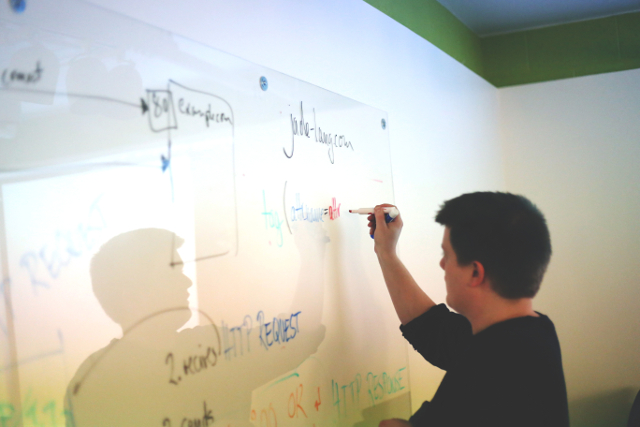

I’m about to finish up my internship as a Software Engineer Intern at Yext in New York City (HQ). Over the past 12 weeks, I’ve learned a lot not only about Java, but also about best practices and how to truly succeed as a developer in today’s fast-moving world. I wanted to share these lessons, hoping that some of you can apply them as you try to make the next step in your career.

## Write Code for Humans, not for Machines

I learned this quickly and early on, as a lot of my code review comments related to naming conventions or making code blocks easier to digest for other developers. After learning this, I believe that every developer needs to apply this mantra as early as possible. It’s the quickest and most surefire way to show that you have what it takes to become an elite contributor.

You will spend a lot of your time reading code, especially as an intern. When somebody hands you a new project or bug fix on a service that you have never touched before, you will usually spend the first hour or so just digesting code. Unfortunately, this initial read-through can get quite drawn out if the code doesn’t make sense to an average person.

*Readability is king.* It makes teams more efficient and agile, and the program will work the exact same regardless. Consider the following Java code snippets, both of which always return the same result:

    Map<Long, Long> convert(Map<Long, Long> map1, Map<Long, Long> map2) {
        Map<Long, Long> ret = new HashMap<>();
        for (Map.Entry<Long, Long> e : map1.entrySet()) {                              
			ret.put(e.getKey(), map2.get(e.getValue()));
        }
        return ret;
    }

    Map<Long, Long> getCustomerIdToProductId(
        Map<Long, Long> customerIdToPurchaseId,
        Map<Long, Long> purchaseIdToProductId)
    {
        Map<Long, Long> customerIdToProductId = new HashMap<>();
        for (Map.Entry<Long, Long> entry : customerIdToPurchaseId.entrySet()) {
			customerIdToProductId.put(entry.getKey(),
                purchaseIdToProductId.get(entry.getValue());
        }
        return customerIdToProductId;
    }

Clearly, the first example gives no indication what *actually *gets computed in the snippet. The developer that wrote the code knew what the code did, so he or she felt no need to write comments or name variables appropriately. As a consequence, any future developer reading the snippet would struggle immensely to understand what happens in the code.

Conversely, the second snippet explains everything. The method declaration conveys the purpose of the method, and the variable names communicate the data that they hold clearly and concisely. Any future developer would have no trouble quickly understanding what this code does. This makes a world of difference in small teams, especially when dealing with large code bases.

**What I learned:** Don’t just write code that works; write code that works **and** is readable, concise, and effective. Yes, it requires a little more effort to name things carefully, but I guarantee your team members will thank you for it later. This will speed up processes for years to come, and it shows that you understand that code is **not only for machines to read.**

## Plan First

On one of my larger stories this summer, I tried to start immediately without planning. For the first ten or so hours, things *seemed* to be going fine. I had written several classes, interfaces, and tests, and had confidence that all of the inputs and outputs worked correctly. Later on, I discovered that the way I had implemented the system wasn’t compliant with existing infrastructure — essentially, I had to rewrite the code from scratch 😢.

Especially when taking on larger stories/projects, do not **ever** dive into the code before planning. Yes, we all know the *fun* part of the job involves writing lines upon lines of code and seeing it work in production. However, without proper planning (the admittedly not-as-exciting part of the job), it’ll be much harder to ever see your code in production.

The way I see it, planning involves several steps, each of them equally important:

1. Define the problem in **the most specific way possible.** This way, you know *exactly* what to think about in the next step.

1. Think about the problem from a birds-eye view, and determine the high-level classes or components that will comprise the system. Then, define how those components will interact with each other.

1. Break the task down into several smaller sub-tasks, and get to work.

After my initial mistake, I made a promise to always spend at least 10% of the estimated time for a task planning for it. **What I learned**: By planning things out and batching them into small sub-tasks, you can actually produce effective code much quicker than before.

I also find it very useful to **draw system diagrams.** Don’t just write in words what you plan to do, but get creative with shapes and lines to really visualize how a whole system will come together. If necessary, tear this page out of your notebook so that you can always see it throughout the whole development process. This made me a more effective developer this summer because I could easily detect code smells and know which classes interacted with each other.

## Ask Lots of Questions

I mean **LOTS** of questions. I genuinely think it would take me hours to scroll through my Slack messages with my mentor — because I never relented in asking questions. At first, I was admittedly scared of asking too many questions; I thought it made me look amateur, like I didn’t deserve to have this job. However, my mentor and my team quickly assured me that I not only *can* ask more questions, but I *should* ask more questions. Instead of being indicative of lack of experience (negative), it’s actually *highly* indicative of natural curiosity (a *huge* positive in the engineering world).

So I did. I asked questions about Java. I asked questions about design patterns. I asked questions about things from tech culture to message processing to career advancement. If I didn’t understand how something worked, I walked across the room and asked someone who knew how that thing worked. People were always happy to spend any amount of time explaining something to me, which I am beyond grateful for.

**What I learned:** It’s much more important to understand the “how”, rather than just the “what”, and asking questions is a great way to bridge the gap. Understanding the “what” means understanding what code works in certain areas, and what code doesn’t. This doesn’t indicate any high-level understanding, but merely shows ability to remember things well. Understanding the “how” is much more impressive, because it means the ability to think deeply about systems and apply that knowledge when making future systems. By asking questions, I could finally understand how the architectural components work together, and how to approach problems at a high level on my own. Now, when in the process of planning, I write down several questions that I later ask to the owner of the service that I’m working on.

**Bonus:** when asking questions, try to do it in person rather than over Slack/IM. It’s a lot more personal, and it allows you to ask follow-up questions much faster.

I would not trade this experience for anything in the world. Yext is a fast-growing company full of extremely talented individuals that I consider myself lucky to surround myself with. I’ve learned a lot about both tech and myself throughout this incredible summer in the center of the universe, New York City.

I’ve grown more this summer as a developer than maybe in my first three years of undergrad. I realized there’s *so* much that the undergraduate education that gets left out, but I’m forever grateful for getting the opportunity to learn so all of the other bits and pieces this summer.

